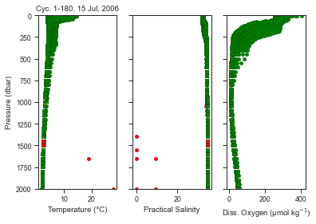
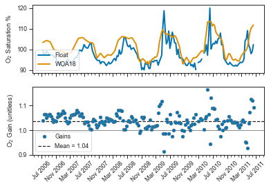

# Argo Canada BGC Quality Control

[](https://anaconda.org/conda-forge/bgcargodmqc)
[](https://argocanada.github.io/bgcArgoDMQC/)
[](https://codecov.io/gh/ArgoCanada/bgcArgoDMQC)

## general description

A `python` library of functions for quality controlling dissolved oxygen data.
Heavily based on the [SOCCOM BGC Argo QC methods](https://github.com/SOCCOM-BGCArgo/ARGO_PROCESSING)
program in `matlab`, uses either
[NCEP](https://psl.noaa.gov/data/gridded/data.ncep.reanalysis.html)
or [World Ocean Atlas](https://www.nodc.noaa.gov/OC5/woa18/) data to
calculate oxygen gains
([*Johnson et al. 2015*](https://doi.org/10.1175/JTECH-D-15-0101.1)).

## installation

The recommended install is through the conda-forge channel, via the command:

```bash
conda install -c conda-forge bgcArgoDMQC
```

The package is also available through the python package index <https://pypi.org/project/bgcArgoDMQC/>, install with:

```bash
pip install bgcArgoDMQC
```
## dependencies

- Must run on `python3.4` or higher, not supported on `python2.x` (uses [pathlib](https://docs.python.org/3/library/pathlib.html), introduced in python version 3.4)
- TEOS-10 package [gsw](https://teos-10.github.io/GSW-Python/)
- [netCDF4](https://pypi.org/project/netCDF4/) module for `.nc` files
- [pandas](https://pandas.pydata.org/) is required
- [seaborn](https://seaborn.pydata.org/)
- [cmocean](https://matplotlib.org/cmocean/) is recommended for nicer plots, but not required

## setup

This package uses locally saved data, as it is designed for QC operators that will likely want to manipulate or export files. This includes accessing WOA and NCEP data. Therefore, the user must tell the package where to look for data. This can either be done inline using the function `bgc.set_dirs(...)`, or permanently using the following code:

```python
from bgcArgoDMQC.configure import configure

argo_dir = '/path/to/my/argo/data/'
woa_dir  = '/path/to/woa/data/'
ncep_dir = '/my/ncep/path/

configure(argo_path=argo_dir, woa_path=woa_dir, ncep_path=ncep_dir)
```

Other items like `operator_name` and `operator_orcid` can be set in this matter as well to a `.config` file saved where the package exists on your machine. All required Argo and reference data can be downloaded using the `io` component of the package, see documentation for more details. All data paths should be structured as they are found. For example, the Argo path should follow the dac structure, so in this example, a profile might be found in `'/path/to/my/argo/data/dac/meds/4900869/profiles/BR4900869_024.nc'`.

WOA and NCEP data can also be downloaded using `bgcArgoDMQC`:

```python
import bgcArgoDMQC as bgc

bgc.io.get_woa18(
    'O2sat', # or other WOA18 var name
    local_path=woa_dir # defined above
)

bgc.io.get_ncep(
    'pres', # or 'rhum' or 'land'
    local_path=ncep_dir, # defined above
    years=(2015, 2025) # year range
)

```

## basic functionality

This section will show the two main components of DOXY DMQC, visually inspecting the data, and calculating the gain relative to a reference dataset. There are many more visualizations that are possible, refer to docs for full plotting reference. 

```python
# import package
import bgcArgoDMQC as bgc

# define a WMO number you want to look at
wmo = 4900869
# load into a synthetic profile object
syn = bgc.sprof(wmo)
# look at the current state of QC flags for T, S, and DO
g1 = syn.plot(kind='qcprofiles', varlist=['TEMP', 'PSAL', 'DOXY'])
```



We can see above that most T/S points are good, with a few obvious outliers in red. The oxygen data also look all good. This is an old float, but for current floats the QC flag for unadjusted oxygen should be 3 (probably bad). 

Since this is an older float, there are no in-air measurements made by the optode. Therefore we will calcualte the gain by comparing surface values to WOA data.

```python
# calculate the gains
gains = syn.calc_gains(ref='WOA')
``` 

The `ref` keyword argument sets the reference dataset. In this case we set it to WOA data. By default `ref` is set to `'NCEP'`, but in this case that would return all `NaN` values since there is no in-air data for this float.

Visualize the gains in a single line:

```python
# plot gains over time, show source data
g3 = syn.plot('gain', ref='WOA')
```
    


I find this plot particularly useful, as sometimes it is a good indicator to go back and inspect certain profiles. We see a couple large spikes in the suface float data. Are those spikes real, or should we go back and have a closer look at those profiles? This could change our mean gain a little, and perhaps we would flag some data as bad that we didn't notice before.


## future developments

- [x] improved netcdf exporting
- [ ] gain calculation with drift, surface carryover for in-air gains
- [ ] expanded capabilities for DMQC on other BGC variables
- [ ] data access via internet (through a package like argopy or argopandas)
